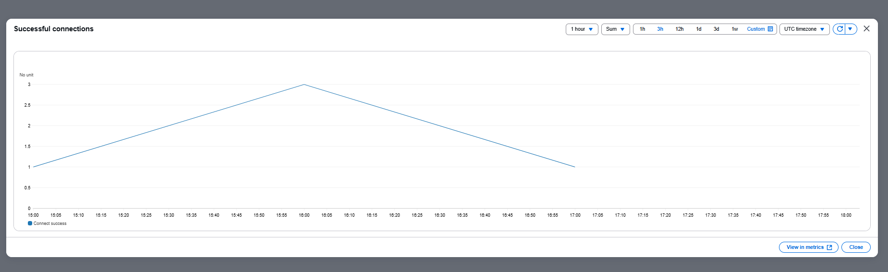
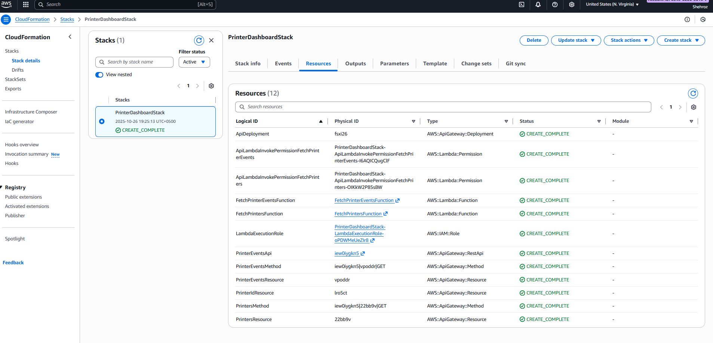

# AWS IoT Printer Monitoring

Real-time **IoT printer monitoring** on AWS using **IoT Core → Lambda → DynamoDB → (optional) API → React Dashboard**.  
Includes environment templates and CI workflow to make the repo look production-ready.

---

## ✨ Features
- Realtime telemetry (MQTT topic: `printers/telemetry`)
- Ingestion via **AWS Lambda** (validate → store)
- Storage in **DynamoDB** (`printer_metrics`)
- (Optional) **API Gateway** for read endpoints
- **React dashboard** to visualize metrics
- GitHub Actions **CI** (installs & builds)

---

## Architecture

## 📸 Screenshots

**IoT Connection**

**AWS CloudFormation**

**DynamoDB**
