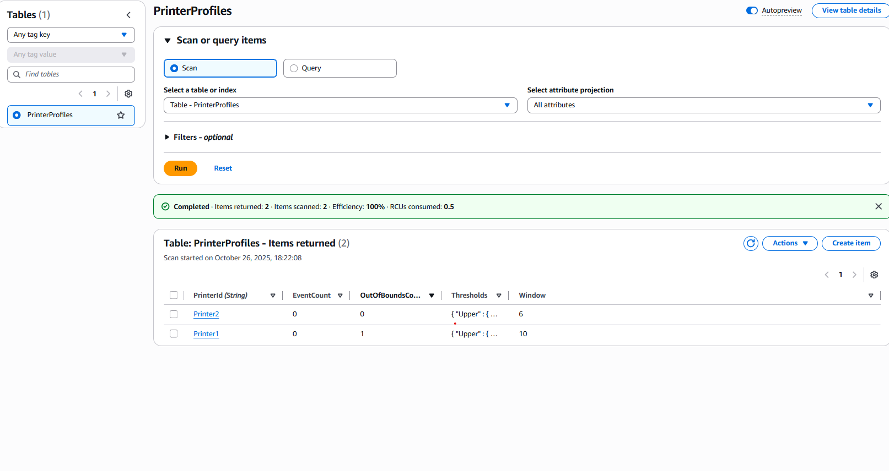

# AWS IoT Printer Monitoring

Real-time **IoT printer monitoring** on AWS using **IoT Core → Lambda → DynamoDB → (optional) API → React Dashboard**.  
Includes environment templates and CI workflow to make the repo look production-ready.

> Inspired by the instructor repo. This is my **documented, refactored** version with a clearer structure and README.

---

## ✨ Features
- Realtime telemetry (MQTT topic: `printers/telemetry`)
- Ingestion via **AWS Lambda** (validate → store)
- Storage in **DynamoDB** (`printer_metrics`)
- (Optional) **API Gateway** for read endpoints
- **React dashboard** to visualize metrics
- GitHub Actions **CI** (installs & builds)

---

## Architecture

flowchart LR
  A[Printer Device / Simulator] --> B[(AWS IoT Core MQTT)]
  B --> C[AWS IoT Rule]
  C --> D[Lambda - Ingest/Validate]
  D --> E[(DynamoDB: printer_metrics)]
  E --> F[API Gateway (optional)]
  F --> G[React Dashboard]
  D --> H[CloudWatch Logs/Alarms]

## 📸 Screenshots
**IoT Connection**

**AWS CloudFormation**

**DynamoDB**
